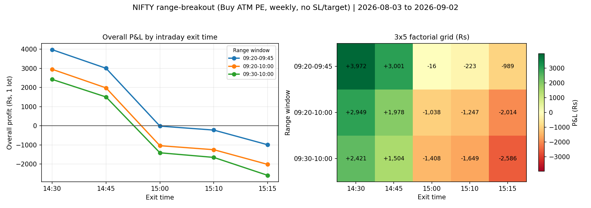

# StockMock Range Breakout Backtest Automation

Automates an intraday NIFTY range-breakout strategy across a matrix of range
windows and intraday exit times on StockMock, and exports the results to CSV
and JSON.

**Strategy:** NIFTY, weekly expiry, ATM strike, BUY PUT, 1 lot, intraday.
No stop loss, no target. Entry on a range breakout, exit at a fixed clock time.

**Matrix:** 8 range windows x 5 exit times = 40 iterations, defined in
`params.py`. See "Credit constraint" for how many were actually executed.

**My understanding of the task**, how the brief maps onto StockMock's form,
what I had to work out about the platform, and the judgement calls I made are
in **[UNDERSTANDING.md](UNDERSTANDING.md)**.

## Quick start

```bash
python -m venv venv
pip install -r requirements.txt
playwright install chromium

python test_runner.py                       # 47 logic checks, no browser
python session_manager.py                   # log in once, saves session.json
python stockmock_runner.py --dry-run        # validate the matrix, zero credits
                                            # (writes only to dry_run_summary.csv)
python stockmock_runner.py --limit 16       # execute
python stockmock_runner.py --resume         # continue later
```

## How it works

StockMock's backtest form has two parts. The position (index, option type,
strike, expiry) and the date range are identical for every iteration; only the
range-window and exit-time dropdowns change.

So the runner does **not** rebuild the form each time. You configure it once in
the browser, press Enter, and the script then only drives the three time
controls and clicks START BACKTEST. This keeps the calendar widgets and the
positions panel out of the automation entirely, which removes the most
brittle part of the job.

Time dropdowns are located by XPath relative to their visible label
(`//*[contains(text(),'Exit Time:')]/following::select`), so no element IDs are
needed for them. Every value is read back after being set, because
`select_option` can silently target the wrong element if an anchor drifts, and
a wrong time is a wasted credit that still looks like a valid result.

## Results

16 runs completed. Runs 1-15 form a complete 3x5 factorial (3 range windows x
5 exit times, no missing cells); run 16 is one extra cell from a fourth window.

Period: 3 Aug - 2 Sep 2026. NIFTY, weekly expiry, ATM, BUY PUT, 1 lot,
intraday, no SL, no target. StockMock applies 0.5% slippage. Estimated margin
Rs 1,625 per lot.



*Regenerate with `python make_chart.py`, which reads the CSV and plots only
fully populated range windows.*

### Full results

| Run | Range window | Exit | Overall P&L (Rs) | Win% (Days) |
|----:|--------------|------|-----------------:|------------:|
| 1  | 09:20-09:45 | 14:30 | **+3,972** | 44 |
| 2  | 09:20-09:45 | 14:45 | **+3,001** | 50 |
| 3  | 09:20-09:45 | 15:00 |        -16 | 44 |
| 4  | 09:20-09:45 | 15:10 |       -223 | 38 |
| 5  | 09:20-09:45 | 15:15 |       -989 | 44 |
| 6  | 09:20-10:00 | 14:30 | **+2,949** | 44 |
| 7  | 09:20-10:00 | 14:45 | **+1,978** | 50 |
| 8  | 09:20-10:00 | 15:00 |     -1,038 | 44 |
| 9  | 09:20-10:00 | 15:10 |     -1,247 | 38 |
| 10 | 09:20-10:00 | 15:15 |     -2,014 | 44 |
| 11 | 09:30-10:00 | 14:30 | **+2,421** | 47 |
| 12 | 09:30-10:00 | 14:45 | **+1,504** | 53 |
| 13 | 09:30-10:00 | 15:00 |     -1,408 | 41 |
| 14 | 09:30-10:00 | 15:10 |     -1,649 | 35 |
| 15 | 09:30-10:00 | 15:15 |     -2,586 | 41 |
| 16 | 09:30-10:30 | 14:30 | **+1,048** | 44 |

### Main effects

Because runs 1-15 are a balanced factorial, each effect can be isolated by
averaging over the other axis.

| Exit time | Mean P&L | | Range window | Mean P&L |
|-----------|---------:|-|--------------|---------:|
| 14:30 | **+3,114** | | 09:20-09:45 | **+1,149** |
| 14:45 | **+2,161** | | 09:20-10:00 |     +126 |
| 15:00 |       -821 | | 09:30-10:00 |     -344 |
| 15:10 |     -1,040 | | | |
| 15:15 |     -1,863 | | | |

Spread across exit times: **Rs 4,977**. Spread across range windows:
**Rs 1,493**. Exit time is roughly 3x the larger effect.

### Interpretation

**Exit time dominates.** Every 14:30 and 14:45 exit is profitable; every 15:00
and later exit loses. All three windows decline monotonically as the exit gets
later, and their relative ranking is identical at every exit time. The pattern
repeating across independent range windows is stronger evidence than any single
cell.

**Range window matters much less.** It shifts the curve up or down but never
changes the sign, and an earlier, shorter window is mildly better.

**Likely mechanism: theta.** These are long ATM weekly puts. Win rate barely
moves across exit times (44, 50, 44, 38, 44 for the first window), so what
changes is the size of outcomes, not their frequency. That is consistent with
time decay over the final ninety minutes rather than a directional effect. A
directional explanation would move the win rate, not just the magnitudes.

### Caveats

These matter more than the numbers above.

- **One month, ~16 trades per cell.** A real theta effect and a lucky month
  look identical at this sample size. Nothing here is statistically
  established.
- **Two days carry most of the profit.** In run 1, 4 Aug (+1,980) and 24 Aug
  (+1,804) account for 3,784 of the 3,972 total. Remove them and the cell is
  roughly flat. This is the classic breakout profile: low win rate, a few large
  winners. Cell rankings partly reflect which cells caught those two days.
- **7 of 23 days produced no trade** (no breakout occurred), so the effective
  sample is smaller than the day count implies.
- **Cells are correlated by construction.** 09:20-09:45 is nested inside
  09:20-10:00, and every exit time shares the same trade up to 14:30. Agreement
  between neighbouring cells indicates parameter stability, not independent
  confirmation.
- **Weekly expiry mixes regimes.** A 15:15 exit on expiry day is a different
  trade from the same exit on a Monday; this analysis pools both.

Treat the best cell as a hypothesis for out-of-sample testing, not a validated
edge. The exit-time gradient is the finding worth carrying forward, and the
natural next step is to re-run it over a longer period, which costs the same
single credit per run.

### Files in `results/`

`results/backtest_summary.csv` and `.json` are the actual results collected for
this assessment: 16 completed runs. `results/dry_run_summary.csv` records 16
combinations validated at zero credits, and `results/pnl_by_exit_time.png` is
the chart above.

**If you re-run the tool, back these up first.** `stockmock_runner.py` writes to
`results/` and, without `--resume`, overwrites `backtest_summary.csv` with the
new session's rows. `--resume` merges instead and skips runs already marked
`completed`. `--dry-run` writes only to `dry_run_summary.csv` and never touches
the live results.

#### Coverage

Runs 1-15 are a complete 3x5 factorial: 3 range windows (09:20-09:45,
09:20-10:00, 09:30-10:00) crossed with 5 exit times (14:30, 14:45, 15:00,
15:10, 15:15), with no missing cells. Run 16 is one extra cell from a fourth
window (09:30-10:30).

Runs 17-40 were not executed. See "Credit constraint" below.

#### Metrics not captured

`max_drawdown` and `return_to_mdd` are not populated in the exported results.

`return_to_mdd` is not a parsing failure. StockMock itself reports it as `NA`
for this period, visible in the platform's own PDF export, because the drawdown
had not recovered within the one-month window.

`max_drawdown` is a collection gap. The label mapping in `config.py` was built
against StockMock's PDF export, which was the only sample of the output
available before the automation could reach the results page. The live panel
lays that field out differently, so it was not matched. By the time this was
visible in the collected data the credit budget was spent, and no run could be
repeated to confirm a corrected mapping.

`overall_profit` and `win_pct_days` are complete for all 16 runs, and the
analysis above rests entirely on those. Drawdown would have added a
risk-adjusted view; it would not have changed which cells win, since the
exit-time gradient is monotonic in profit across all three range windows.

## Credit constraint

StockMock charges **1 credit per run** for up to 1 year of data. The free tier
gives 20 credits on signup and refills to 15 daily. Forty iterations therefore
cannot be executed in a single day without payment.

Actual spend: 1 manual run (to capture the results-panel selector), 2 lost to
a wrong selector before the abort triggered, 15 automated, so 18 of 20. The
full 40-run matrix is defined in `params.py` and `--resume` continues across
days as credits refill.

Note that a one-month backtest costs the same single credit as a one-year one.
`WINDOW_MODE` in `params.py` switches between `trailing` (default, ~1 month),
`month` (literal 1st-to-today) and `year`. The brief specified the current
month; a literal reading gives only 2 trading days when run on the 3rd, so the
default is a trailing 30-day window.

## Safeguards

Each exists because of a specific failure mode, most of which occurred.

**Stale results.** After the first run the results panel already exists, so a
plain `wait_for_selector` returns instantly with the *previous* run's numbers.
Every later run would report run 1's figures and the CSV would look fine.
`wait_for_fresh_results` snapshots the panel before clicking, waits for the
text to change, then waits for it to stop changing.

**Preflight.** Aborts before opening the browser if the matrix varies a
parameter the configured selectors cannot actually control, which would
produce duplicate results at full price.

**Credit guard.** Reads StockMock's live "will consume N Credit" notice and
refuses to click if it exceeds `--max-credits-per-run`.

**Abort on repeated failure.** Stops after 2 consecutive failures. A wrong
`results_container` cost 2 credits instead of 16.

**Selector self-diagnosis.** On a results timeout, the runner scans the live
page for the smallest element containing the stats and prints ready-to-paste
selector candidates. This is how `div.__result__container.col-md-12` was
found, without DevTools.

**Resume merges.** `--resume` reloads existing rows before writing, so
continuing on a later day cannot overwrite earlier results.

**Dry runs are isolated.** `--dry-run` writes to `dry_run_summary.csv` so
validation never pollutes real results.

## Notes on the platform

- **Cloudflare blocks headless Chromium** with a "you have been blocked"
  interstitial. Headed works normally, so every browser this project opens is
  visible. `session_manager.py --check --headless` demonstrates the difference.
- **StockMock is a hash-bang SPA**; the builder is at `/#!/home`. The plain
  `/backtest.html` path is a marketing page.
- **The 09:15 candle is excluded** by StockMock, and entry defaults to 09:22,
  so range windows start at 09:20 at the earliest.
- **Range breakout is defined by time only.** There are no price fields;
  StockMock computes the high and low of the window itself. The form confirms
  the window in text ("High & Low of the Range will be considered between
  09:20 open and 9:44 closing time"), which the runner logs for every run.
- **Metrics are day-wise, not trade-wise.** "Win% (Days)" is the share of
  profitable days; there is no per-trade win rate.
- **0.5% slippage is included** by StockMock for options strategies.

## Files

| File | Purpose |
|---|---|
| `config.py` | Paths, timeouts, all selectors, metric label mapping |
| `params.py` | The 40-run matrix and the date window |
| `session_manager.py` | One-time login, saves and validates `session.json` |
| `stockmock_runner.py` | The batch runner |
| `manual_entry.py` | Record a run by pasting its stats, same output format |
| `make_chart.py` | Regenerates the results chart from the CSV |
| `test_runner.py` | 47 checks including a regression test on real output |
| `UNDERSTANDING.md` | My reading of the task and of the platform |
